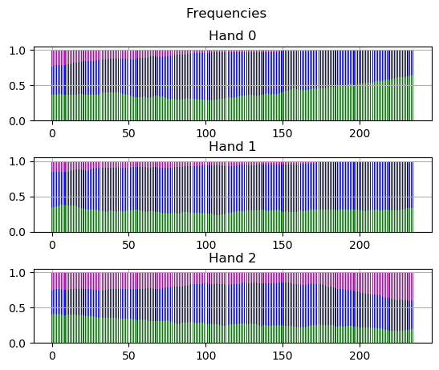

# PokerAI

A combination of poker environment simulator and a bitwise Omaha hand winner evaluator written in Rust. 

## To build the Omaha Evaluator

to build rust code, cd into rusteval and run

```
cargo build --release
```
(you should have rust installed ofc. `brew install rust` if you don't have it yet.)

## Source code is contained within src

# Poker Environments

There are a number of environments, each increasing in complexity.

# Kuhn

- Deck [A,K,Q]
- Betsize fixed at 1
- Raise size fixed at 2
- Initial pot of 1
- 1 Street

## Simple Kuhn

SB Options:
Check,bet,fold

BB Options: *facing bet only*
Call,fold

Solution:

SB 
Q should mostly fold/check (equal actions). bet occasionally
K should check entirely
A should bet entirely

Baseline performance


BB
Q fold always
K facing bet, should call occasionally
A call always

Baseline performance


## Complex Kuhn

SB Options:
Check,Bet
Call,Fold facing raise

BB Options:
Bet,Check facing Check
Call,Raise,Fold facing Bet

Solution:

SB 
Q should mostly fold/check (equal actions). bet occasionally
K should check entirely
A should bet entirely

Baseline performance


BB
Q fold always
K facing bet, should call occasionally
A Raise always

Baseline performance


## Decoding cards

Initial test: 
- 13 cards in a row
- try with the board obscured.

2nd test:
- 9 cards without villain hand
- 4 cards without board and villain.

3rd test:
- 60 combinations of 2 cards of heros hand and 3 of board + the same for villain
- Hero only
- Hero combinations with mystery board cards

### Networks

Layer that takes 5 cards and outputs a strength signal?
process the hand, process the hand + board
process hand, process board, add together
Test group has all hand strengths
Test individual hand cases [high card,pair,two pair,3 of a kind,straight,flush,FH,quads,straight flush]

- Convnet + Multiheaded attention? Attention could select a particular hand of interest
- Convnet + FC
- Embedding + FC

### How to deal with Hole Cards with varying amounts of information about the board

- Mask inputs
- Run convolutions/fc on hidden state. Encode cards first and then pass into fc.

## Added betsize

Additional levels to network that outputs a analog value, which is a % of pot. 

## Multiple streets

Dealing with histories. Record only actions and game situations? or include board and hands.

## Full game

Possibilities:
MuZero-esque. Dynamics Model (samples outcomes), Villain model (predicts opponents actions), Predicting next card.
- Transformer/LSTM
- Hidden dynamics with optional recursion.

