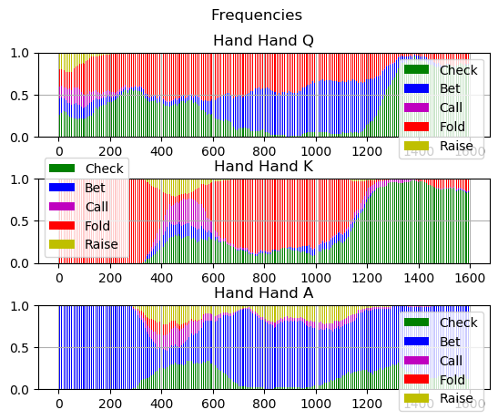

# PokerAI

A combination of poker environment simulator and a bitwise Omaha hand winner evaluator written in Rust. 

## Requirements

There are two requirement files, one for pip and one for conda.
```pip install pip_requirements.txt```
or 
```conda create --name <env> --file conda_requirements.txt```

## To build the Omaha Evaluator

to build rust code, cd into rusteval and run

```
cargo build --release
```
(`brew install rust` if you don't have it.)

## MongoDB

Is used for storing the RL training run data and generating plots.

### Ubuntu
https://docs.mongodb.com/manual/tutorial/install-mongodb-on-ubuntu/

### OSX
https://docs.mongodb.com/manual/tutorial/install-mongodb-on-os-x/

# Abstract

A series of poker environments that cover each of the individual complexities of poker, allowing one to test networks and learning architectures quickly and easily starting from the simpliest env all the way to real world poker. The goal is a single API that interfaces with the training architecture for the agent such that you can scale the complexity as needed. Asserting that the learning algorithm learns at all stages.

Additionally there is a sub library in hand_recognition if you want to test networks on ability and efficacy of understanding hand board relationships

# Using the library

Build the data and all the folders by ```python setup.py```

Build a specific dataset with ```python build_dataset.py -d <dataset>```

Modify poker/models/network_config.py to change which network to train. Add or modify poker/models/networks.py to try different models.

Train a network for 10 epochs (loaded from the network_config) on a dataset with ```python cards.py -d <dataset> -M train -e 10```
Examine a network's output (loaded from the network_config) on a dataset with ```python cards.py -d <dataset> -M examine```
Train an RL agent on an env with ```python main.py --env <environment>```
Plot the RL training results with ```python visualize.py```

# Hand recognition

To build all the datasets run

```python setup.py```

to train a network on a dataset

```python cards.py -d <dataset> -M train -e 10```

to examine a trained network

```python cards.py -d <dataset> -M examine```

# Poker Environments

There are a number of environments, each increasing in complexity.

# Kuhn

- Deck [A,K,Q]
- Betsize fixed at 1
- Raise size fixed at 2
- Initial pot of 1
- 1 Street

## Simple Kuhn

*SB Options:*
- Check,bet,fold

*BB Options:* _facing bet only_
- Call,fold

#### Solution:

*SB*
- Q should mostly fold/check (equal actions). bet occasionally
- K should check entirely
- A should bet entirely

_Baseline performance_


*BB*
- Q fold always
- K facing bet, should call occasionally
- A call always

_Baseline performance_


## Complex Kuhn

*SB Options:*
- Check,Bet
- Call,Fold facing raise

*BB Options:*
- Bet,Check facing Check
- Call,Raise,Fold facing Bet

#### Solution:

*SB*
- Q should mostly fold/check (equal actions). bet occasionally
- K should check entirely
- A should bet entirely

_Baseline performance_


*BB*
- Q fold always
- K facing bet, should call occasionally
- A Raise always

_Baseline performance_



## Limit holdem with full deck


## Added betsize

The important part about betsizing is that if i break actions into categories and then within those categories you can choose sizing. Improper sizing will result in the category not being chosen as often. Conversely, if i use a critic, the critic must be able to take an action an a betsize. Ideally you update both against the betsize and the action not just the action category. Additionally its important to be able to have mixed strategies. So either gaussian or descrete categorical output for betsize is also preferred. such that different categories can be reinforced. 

Additional levels to network that outputs a analog value, which is a % of pot. 

Will test initially two sizes 0.5p and 1p along with check,fold etc. All as a categorical output with the action space descretized. Then scale up to something like 100 descretized.

## Multiple streets

Dealing with histories. Record only actions and game situations? or include board and hands.
- Transformer
- LSTM

## Full game

Possibilities:
MuZero-esque. Dynamics Model (samples outcomes), Villain model (predicts opponents actions), Predicting next card.
- Transformer/LSTM
- Hidden dynamics with optional recursion.